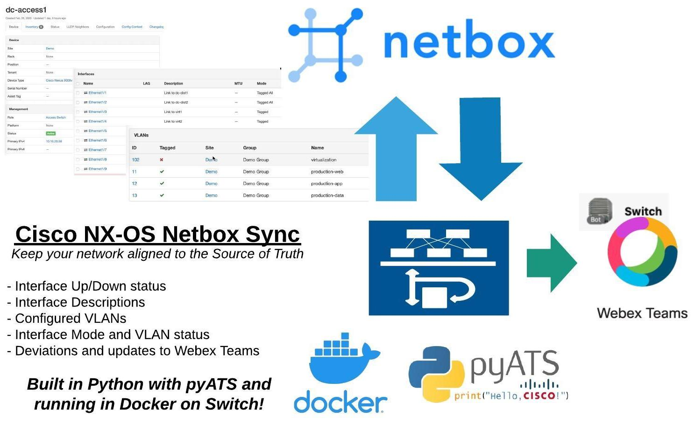
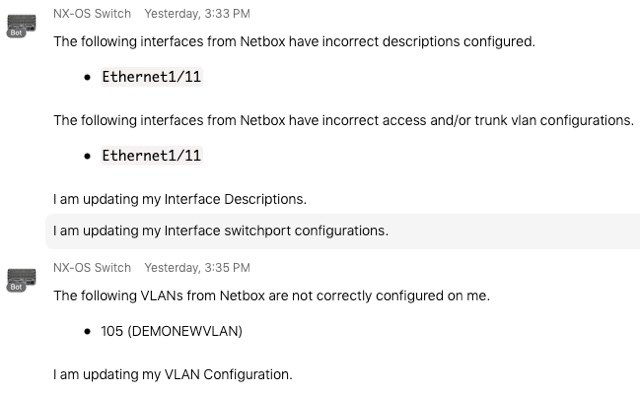
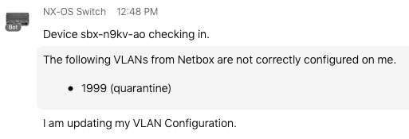

> This is a work in progress project.  A more detailed README will come soon!

# Cisco NX-OS Netbox Sync



I built this application as a demonstration of how a Source of Truth can drive network configuration by not only verifying that a network devices configuration matches the Source of Truth, but also implement changes when deviations are found.  

```text
Retrieving current status from device with pyATS
Looking up intended state for device from Netbox
Running tests to see if VLANs from Netbox are configured
❌ 11 MISSING from switch
❌ 12 MISSING from switch
❌ 13 MISSING from switch
✅ 21 (test-web) exists with correct name on switch
✅ 22 (test-app) exists with correct name on switch
✅ 23 (test-data) exists with correct name on switch

Running interface enabled test
✅ Ethernet1/1 was correctly found to be UP/UP on switch
✅ Ethernet1/2 was correctly found to be UP/UP on switch
✅ Ethernet1/3 was correctly found to be UP/UP on switch
✅ Ethernet1/4 was correctly found to be UP/UP on switch
✅ Ethernet1/5 was correctly found to be UP/UP on switch
✅ Mgmt0 was correctly found to be UP/UP on switch

Running interface description test
✅ Ethernet1/1 has the correct description configured on switch
✅ Ethernet1/2 has the correct description configured on switch
✅ Ethernet1/3 has the correct description configured on switch
✅ Ethernet1/4 has the correct description configured on switch
✅ Mgmt0 has the correct description configured on switch

Running interface mode test
✅ Ethernet1/2 is correctly configured as a trunk
✅ Ethernet1/3 is correctly configured as a trunk
✅ Ethernet1/4 is correctly configured as a trunk
✅ Ethernet1/5 is correctly configured as a trunk

Running interface vlan test
✅ Ethernet1/2 correctly is trunking ALL vlan ids.
❌❌ Vlan 11 is NOT configured on the switch.
❌❌ Vlan 12 is NOT configured on the switch.
❌❌ Vlan 13 is NOT configured on the switch.
✅ Ethernet1/6 correctly has 13 configured as the access vlan id

Creating 11 (production-web)
Creating 12 (production-app)
Creating 13 (production-data)
Updating Interface Ethernet1/4 mode to Tagged
Updating Interface Ethernet1/5 mode to Tagged
Updating Interface Ethernet1/3 mode to Tagged
```

The technologies used in this demonstration are: 

* [Netbox](http://netbox.readthedocs.io) - A modern IPAM and DCIM tool, written in Python and providing robust programmability support through APIs and SDKs
* [pyATS](http://developer.cisco.com/pyats/) - A network verification and configuration tool used to gather operational and configuration details from a live network, as well as make configuration changes.  
* [Docker](https://www.docker.com/resources/what-container) - A container technologies used to "package" up the application into a portable image that can be run nearly anywhere 
* [Cisco NX-OS](http://developer.cisco.com/nx-os) - A programmable network operating system providing many features, including running containers on the switch. 
* [Webex Teams](https://www.webex.com/team-collaboration.html) - An collaboration platform offering rich communication and programmability features allowing for robust ChatOps use cases.

Here are some videos that show the application in action:  

* <a href='https://youtu.be/iD5VrL82j6E' target="_blank">Cisco NX-OS Netbox Sync Demo1: In Action</a>

## Project Goals 
This project is not intended to cover every aspect of the network configuration, at least not the initial version. Rather my goal was to tackle a few of the common areas I see from my own network and discussions with others that would be hugely valuable for a solution like this.  Specifically this application tackles the following.  

* Ensure all VLANs identified in Netbox for the switches "site" are present on the the device with the correct name 
* Ensure interface enabled status from Netbox matches the `shut / no shut` state on the switch 
* Ensure interface descriptions from Netbox are configured on the switch 
* Ensure interface switchport configuration from Netbox are accurately deployed to the switch. Includes `access / trunk` configuration as well as access, native, and trunked VLANs. 

If a deviation is found between Netbox and the device a ChatOps message is sent to a designated room within Webex Teams. 



> NOTE: Before using this code in your own environment, see the [Caveats / Known Issues / Later Updates](#caveats--known-issues--later-updates) Section at the end of this README. 
> 
> Also, this demo is provided as-is but with no gaurantees of any level of functionality, or that it won't cause problems in your own envirnoment.  It's a **DEMONSTRATION** of a topic, offered as an example of a concept.  I do ***NOT*** recommend taking this code as is and running in production, or in any environment where the potential for catastrophic failure isn't a comfortable result.  ***YOU HAVE BEEN WARNED***

## Running the Demo Yourself 
So you'd like to see it in action, I mean, who wouldn't.  There are options: 

1. Run using DevNet Sandbox
    * Uses the [Open NX-OS Always On Sandbox](https://devnetsandbox.cisco.com/RM/Diagram/Index/dae38dd8-e8ee-4d7c-a21c-6036bed7a804?diagramType=Topology)
    * Uses a demonstration Netbox server setup for this demo and offering READ-ONLY access to data
    * You will run the demo code itself on your local workstation with Python or Docker.
1. Run with your own lab
    * You'll need your own NX-OS switch
    * You'll need to your own Netbox server (link to setup instructions below)
    * You'll need to configure Netbox to have your device and VLAN configurations
    * You'll have the option to run the application on the NX-OS switch as a Docker container if it is a Nexus 9000/3000 running 9.2.1 or higher

### Pre-Reqs and Stuff Not Covered in Details
I'll do my best to detail out what you need to know to run this demo in the different forms, but a few things are assumed to be known or aware of already.

* Basic Python knowledge 
* Basic Docker knowledge 
* Basic Netbox knowledge 
* Basic bash / environment knowledge 

Furthermore, while all the code for the demo is in the repo, the demo instructions will not include a walkthrough and explaination of how it all works.  

Further-furthermore, while not explicitly required, in order for the application to send Webex Teams messages for ChatOps, you'll need a Webex Teams account (you can get a free account), and setup a "Bot App" to use.  You can find [Learning Labs](https://developer.cisco.com/learning/modules?keywords=bot) that cover Webex Teams APIs and Bots on [DevNet](https://developer.cisco.com/learning/modules?keywords=bot).  The key part for this demo is creating the "Bot" and retrieving it's Token.  Also, you'll need to retrieve the roomId for where to send the alerts, more on this later. 

## Run using DevNet Sandbox


## Run with your own lab
I fully expect everyone to want to try this out with their own lab setup, it's just that cool.  But before you jump in, I gotta repeat the warning from above.  

> NOTE: Before using this code in your own environment, see the [Caveats / Known Issues / Later Updates](#caveats--known-issues--later-updates) Section at the end of this README. 
> 
> Also, this demo is provided as-is but with no gaurantees of any level of functionality, or that it won't cause problems in your own envirnoment.  It's a **DEMONSTRATION** of a topic, offered as an example of a concept.  I do ***NOT*** recommend taking this code as is and running in production, or in any environment where the potential for catastrophic failure isn't a comfortable result.  ***YOU HAVE BEEN WARNED***

That out of they way, here's how you can set this up in your own lab.  

### Netbox Preperation
First thing you'll need is to get a Netbox server up and running.  If you have one, great.  If not you can easily get one running quickly using the [netbox-docker](https://github.com/netbox-community/netbox-docker) method available and well documented on GitHub.  

Once you have Netbox running, you'll need to add the device to the DCIM inventory, configure it's interfaces, and create the VLANs desired.  

> Reminder.. if you're running this on a switch that already has some configuration on it that you want to make sure stays the same and isnt' damaged, you should configure Netbox to match the current state.  Failure to do so could result in your switch loosing configuration.  

### NX-OS Switch Preperation
For the basic use case of verifying and updating configuration on the switch with what is published in Netbox, just about any NX-OS switch will do.  You'll just need to have the management IP address and credentials ready to provide the application.  But if you'd like to run the application container ON THE SWITCH itself, you'll need to take a few steps to prepare it.  

> For full details on Docker on NX-OS see the [product documentation](https://www.cisco.com/c/en/us/td/docs/switches/datacenter/nexus9000/sw/92x/programmability/guide/b-cisco-nexus-9000-series-nx-os-programmability-guide-92x/b-cisco-nexus-9000-series-nx-os-programmability-guide-92x_chapter_010010.html).

1. Due to details on how the management VRF and namespaces operate on NX-OS you'll need to setup an "INBAND" management address to use to connect.  This can be a loopback, vlan interface, or layer-3 physical interface, it just can't be the `Mgmt 0` port on the switch itself. As en example... 

    ```
    interface Ethernet1/1
        description Inband Management Interface 
        no switchport
        ip address 10.10.20.59/24
    ```

1. Enable the bash-shell access on the switch and connect as root

    ```
    feature bash-shell
    run bash sudo su -
    ```

1. Before you start docker, you'll need to verify that enough disk space is allocated for containers. Edit `/etc/sysconfig/docker` and make sure `small_dockerstrg` it at least 900.

1. Start and verify Docker. 

    ```
    service docker start 
    chkconfig --add docker 

    # verify 
    service docker status 
    ```

1. Pull down the Docker image for the app onto the swich. 

    ```
    ip netns exec management docker pull hpreston/nxos-netbox-sync:latest
    ```

    > Note: This is pulling the container that I published to Docker Hub.  You can also build your own image using the Dockerfile included in the repo as an alternative.  

1. If you have problems connecting to the Docker to pull the image, verify that DNS is configured correctly, and that the switch has access to the Internet through the management interface.  This is required not just to pull the image, but also to send messages to Webex Teams.

### Running the Application Locally
Now let's get the application running. 

1. First, clone down this repository to your workstation. 
1. While we will work up to running in Docker, we'll start more simply by running in a Python virtual-environment. ***Note: I recommend the latest version of Python 3.6 or 3.7.***

    ```
    python3 -m venv venv 
    source venv/bin/activate
    pip install -r requirements.txt 
    ```

    > This will install the Python requirements into your virtual environment.

1. Included in the repo is a file `src_env.template`.  This is a template file for you to use to create your own `src_env` file that will hold all the "secrets" for the application.  

    ```bash
    # Sample environment variables file for storing key details for the application
    export NETBOX_URL=""
    export NETBOX_TOKEN=""

    export SWITCH_HOSTNAME=""
    export SWITCH_MGMT_IP=""
    # export SWITCH_MGMT_PORT=""   # Specify SSH port if it is NOT 22
    export SWITCH_USERNAME=""
    export SWITCH_PASSWORD=""

    export TEAMS_TOKEN=""
    export TEAMS_ROOMID=""
    ```

1. Copy this file and name it `src_env`.  Fill in the details for each value for your implementation. Some notes: 
    * The Netbox token can be found under your profile.  If you create a token, this application only needs read access 
    * The `SWITCH_HOSTNAME` is used to locate the device in Netbox, be sure it matches.
    * The application is written to connect wtih SSH to the NX-OS device
    * The `TEAMS_TOKEN` is the Bot token you will use for ChatOps.  You were given this token when you created the Bot app. 
    * The simplest way to find the roomId for Teams is to add the bot `inspect@webex.bot` to a room and ask it it for the `roomId` (case sensitive). It will then reply with the roomId for that room.  
        > Note: if you do NOT provide the TEAMS info, the application will run fine, but no messages will be sent to a Chat room.  You can monitor the status by looking at the standard output.

1. Now `source` the `src_env` file to create environment variables in your terminal session. 

    ```
    source src_env
    ```

1. You can now run the application. 

    ```
    python check_device.py
    ```

    <details>
    <summary>Sample Output</summary>

        Retrieving current status from device with pyATS
        Looking up intended state for device from Netbox
        Running tests to see if VLANs from Netbox are configured
        ✅ 100 (mgmt) exists with correct name on switch
        ✅ 101 (prod) exists with correct name on switch
        ✅ 102 (dev) exists with correct name on switch
        ✅ 103 (test) exists with correct name on switch
        ✅ 104 (security) exists with correct name on switch
        ✅ 105 (iot) exists with correct name on switch

    </details>

1. If there were any differences in the configuration and Netbox, you should see some lines like this in the output. 

    ```
    ❌ 1999 MISSING from switch
    .
    .
    Creating 1999 (quarantine)
    ```

1. And look for ChatOps messages like this in your Teams room.  

    

1. While the application is running, either remove some configuration from the switch, or add something new to Netbox to see the sync-tool in action!

1. Stop the application with `Cntrl-C`

### Building a Container and Running in Docker
Now you know the application works... let's container-ize it.  

1. Build a container. 

    ```
    docker build -t nxos-netbox-sync:latest .
    ```

    > Note: If you have a Docker Hub account (or another registry), use that in the tag name so you can `push` it. 

1. Run the container. 

    ```
    source src_env 
    docker run --rm -it \
        -e NETBOX_URL="${NETBOX_URL}" \
        -e NETBOX_TOKEN="${NETBOX_TOKEN}" \
        -e SWITCH_HOSTNAME="${SWITCH_HOSTNAME}" \
        -e SWITCH_MGMT_IP="${SWITCH_MGMT_IP}" \
        -e SWITCH_USERNAME="${SWITCH_USERNAME}" \
        -e SWITCH_PASSWORD="${SWITCH_PASSWORD}" \
        -e TEAMS_TOKEN="${TEAMS_TOKEN}" \
        -e TEAMS_ROOMID="${TEAMS_ROOMID}" \
        nxos-netbox-sync:latest
    ```

    > Note: If your switch uses a port other than 22 for SSH, you'll need to add an additional environment variable of `-e SWITCH_MGMT_PORT="${SWITCH_MGMT_PORT}"` to the command.

     <details>
    <summary>Sample Output</summary>

        [Entrypoint] Starting pyATS Docker Image ...
        [Entrypoint] Workspace Directory: /pyats
        [Entrypoint] Activating workspace
        [CMD] Starting NX-OS Netbox Sync ...
        [CMD] Activating pyATS virtualenv
        [CMD] Running check_device.py
        Retrieving current status from device with pyATS
        Looking up intended state for device from Netbox
        Running tests to see if VLANs from Netbox are configured
        ✅ 100 (mgmt) exists with correct name on switch
        ✅ 101 (prod) exists with correct name on switch
        ✅ 102 (dev) exists with correct name on switch
        ✅ 103 (test) exists with correct name on switch
        ✅ 104 (security) exists with correct name on switch
        ✅ 105 (iot) exists with correct name on switch

    </details>

1. Stop the container with `Cntrl-C`

### Running as a Container on the Switch 
And the final step, running the container on the switch. 

1. On your switch, jump into the bash shell

    ```
    run bash sudo su -
    ```

1. If you pushed your Docker image to a repository, pull it down with a command like this. ***Note: this command pulls the image from my Docker account.  It should work, but it isn't YOURS.***

    ```
    ip netns exec management docker pull hpreston/nxos-netbox-sync:latest
    ```

1. Create all the environment variables on the switch.  It's simplest to just copy the contents of your `src_env` file and paste into the switch. 

1. Now run the container on the switch just like you did locally.  

    ```
    docker run --rm -it \
        -e NETBOX_URL="${NETBOX_URL}" \
        -e NETBOX_TOKEN="${NETBOX_TOKEN}" \
        -e SWITCH_HOSTNAME="${SWITCH_HOSTNAME}" \
        -e SWITCH_MGMT_IP="${SWITCH_MGMT_IP}" \
        -e SWITCH_USERNAME="${SWITCH_USERNAME}" \
        -e SWITCH_PASSWORD="${SWITCH_PASSWORD}" \
        -e TEAMS_TOKEN="${TEAMS_TOKEN}" \
        -e TEAMS_ROOMID="${TEAMS_ROOMID}" \
        nxos-netbox-sync:latest
    ```

    > Note: If your switch uses a port other than 22 for SSH, you'll need to add an additional environment variable of `-e SWITCH_MGMT_PORT="${SWITCH_MGMT_PORT}"` to the command.

     <details>
    <summary>Sample Output</summary>

        [Entrypoint] Starting pyATS Docker Image ...
        [Entrypoint] Workspace Directory: /pyats
        [Entrypoint] Activating workspace
        [CMD] Starting NX-OS Netbox Sync ...
        [CMD] Activating pyATS virtualenv
        [CMD] Running check_device.py
        Retrieving current status from device with pyATS
        Looking up intended state for device from Netbox
        Running tests to see if VLANs from Netbox are configured
        ✅ 100 (mgmt) exists with correct name on switch
        ✅ 101 (prod) exists with correct name on switch
        ✅ 102 (dev) exists with correct name on switch
        ✅ 103 (test) exists with correct name on switch
        ✅ 104 (security) exists with correct name on switch
        ✅ 105 (iot) exists with correct name on switch

    </details>

## Caveats / Known Issues / Later Updates
A few things to be aware of should you look to leverage this code for something within your own environment. 

* Determining which VLANs from Netbox should be configured on a specific device isn't a uniformly clear linkage within Netbox.  The code in this demonstration uses the **Site** as the connecting link.  This means that every VLAN, from all VLAN Groups, configured to be at the same Site as the switch will be installed.  If a Netbox implementation uses multiple VLAN Groups within a Site, and each device should only be tied to a particular VLAN Group you will need to update the code to support this setup.
* Currently the code only does VLAN verification in one direction, that Netbox VLANs are configured on the Switch.  If extra VLANs exist on the switch that are **NOT** in Netbox they are ignored.  